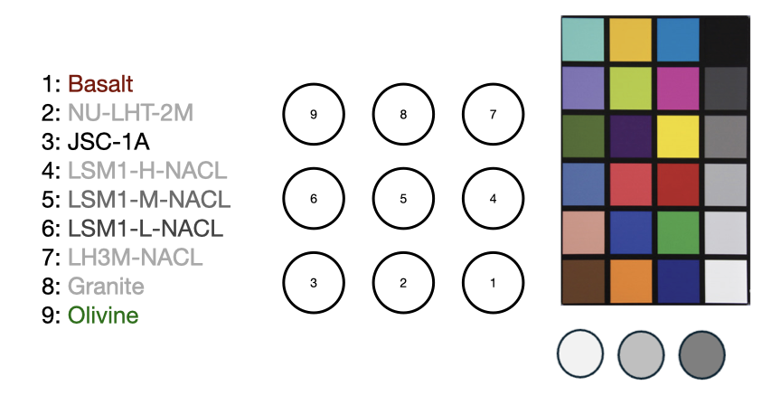
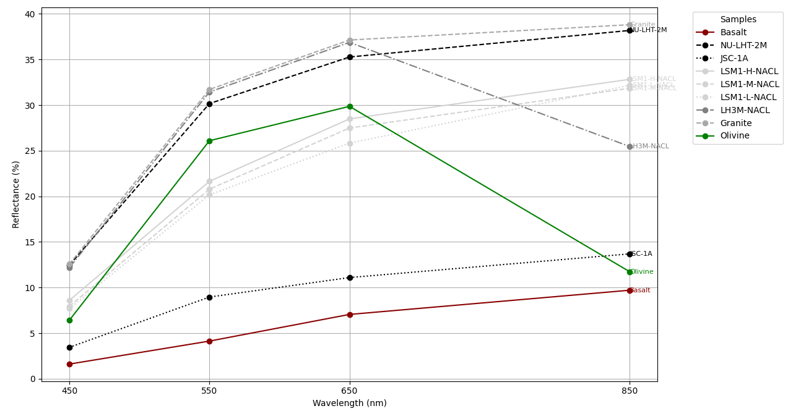

## AKALL NIR & RGB Reflectance Analysis



### Overview
This research provides a set of image processing tools for analyzing RGB and Near-Infrared (NIR) data captured with depth cameras. The analyses involve extracting and processing different color channels from RGB images and NIR images for further reflectance analysis.

The `convert` command below is part of ImageMagick, a powerful tool for image manipulation. Make sure you have it installed before running the commands.
```bash
sudo apt-get install imagemagick
```

## RGB + NIR Analysis Commands
The following commands use ImageMagick to separate the different color channels from an RGB image and process the NIR image.

### Extracting RGB Channels
At first, extract the Blue (450nm), Green (550nm), and Red (650nm) channels from an RGB image and perform an auto-level adjustment, use the following commands:

```bash
convert RGB.jpeg -colorspace RGB -channel B -separate -auto-level B.jpeg
convert RGB.jpeg -colorspace RGB -channel G -separate -auto-level G.jpeg
convert RGB.jpeg -colorspace RGB -channel R -separate -auto-level R.jpeg
```

### Processing NIR Image
To process the NIR (850nm) image, convert the raw data into a PGM format and normalize the image:

```bash
convert -size 640x576 -depth 16 -endian LSB -define quantum:format=unsigned -define quantum:separate -depth 16 gray:NIR.raw -normalize NIR.pgm
```

### Relative Reflectance Measurmment 
#### Scene Calibration
To calibrate the Blue, Green and Red reflectance measurment in a given scene, run the following command on a scene that contains a Color Checker (Macbeth) and Reflectance targets. Update the calibration.json file with the scenes (R, G, B, and NIR) reflectance values. Run the command below to compute the relative reflectance of the Red, Blue and Green marks in NIR image.

```bash
python3 proc.py images/NIR.pgm --channel NIR --points 3
```

Example reflectance calibration.json file
```
{
    "B": 12.21,
    "G": 27.54,
    "R": 40.88,
    "NIR": 30.0
}

```
#### Scene Processing
Run the following to compute the relative reflectance.
```bash
python3 proc_all.py --blue blue.jpeg --green green.jpeg --red red.jpeg --nir nir.pgm --points 9 --calibration calibration.json
```

Example command:
```bash
python3 proc_all.py --blue images/B_1731624458C5MJPG3072P.jpeg --green images/G_1731624458C5MJPG3072P.jpeg --red images/R_1731624458C5MJPG3072P.jpeg --nir images/1731624411IR5640NFOV_UNBINNED.pgm --points 9 --calibration calibration.json
```

#### Plotting data
The data to plot is saved as reflectance_data_timestamp.cvs. Execute the following command to plot the relative reflectance measurments per sample registered.
```bash
python3 plotter.py reflectance_data_timestamp.csv --meta calibration.json
```

